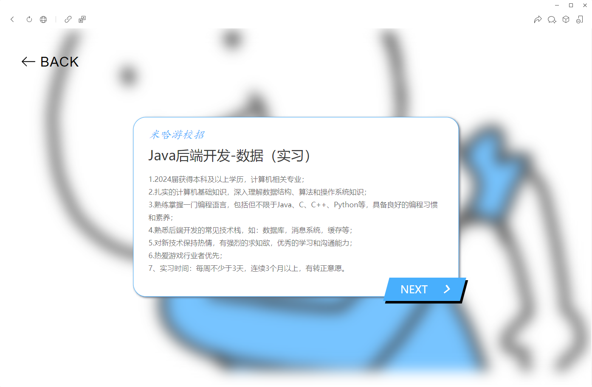

What Should I Do
===============

功能介绍
---
该网站可根据用户提供的关键词，提供匹配的校招和实习岗位的岗位需求，以便用户根据岗位需求明确学习方向

[在线体验](https://sandtripper.cn/WSID/)

页面截图
---




本地部署：
---

####web后端

服务器需要安装 mysql 5.0 以上版本

程序默认表为：what_should_i_do.job_information_tb

表结构如下:

```sql
CREATE TABLE IF NOT EXISTS `job_information_tb`(
    `id` int(11) PRIMARY KEY AUTO_INCREMENT,
    `recruitment_unit` varchar(63) NOT NULL,
    `post_name` varchar(255) NOT NULL,
    `require_text` text
)CHARSET=utf8mb4;
```

请提前建好表并导入数据

在项目根目录运行 go build 即可编译出可执行文件

####数据爬取

该爬虫脚本使用 Selenium+Chromedriver 模拟人手点击以实现招聘信息的收集，能适配绝大多数公司招聘官网

爬虫有关的脚本都放在项目/spider文件夹中

其中 main.py 是爬虫的主程序

spider_hook.json 是爬虫的配置文件，通过配置文件就可添加新的招聘网站，以下是字段含义：

url : 岗位查找页链接

next_page_key : 下一页按钮的定位方式，可选择xpath定位和class_name定位

find_next_page_by_class : 是否使用class_name定位

page_from : 爬虫的开始页

page_to : 爬虫的结束页

box_xpath : 单个岗位按钮的xpath

box_from : 岗位框的起始序号

box_to : 岗位框的结束序号

name_xml : 岗位详情页中岗位名字的xpath地址

require_xml : 岗位详情页中岗位需求的xpath地址

enable : 是否可用

爬虫完成后会生成一个json文件，此时运行 write_into_mysql.py 即可将数据导入数据库

TODO
---
* [ ] 优化数据库查询与存量判定
* [ ] 增加对配置文件的支持

关键词
---
校招,实习,爬虫,互联网大厂,前端,后端